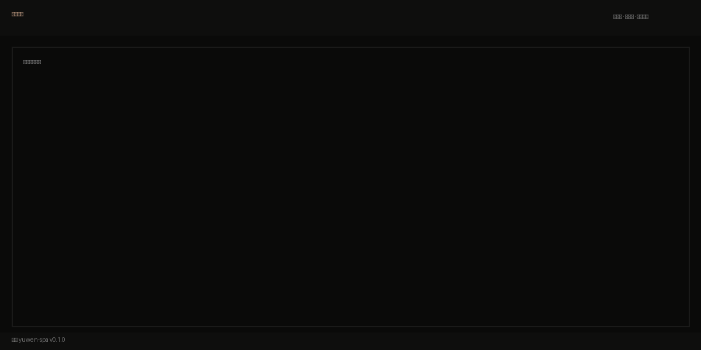
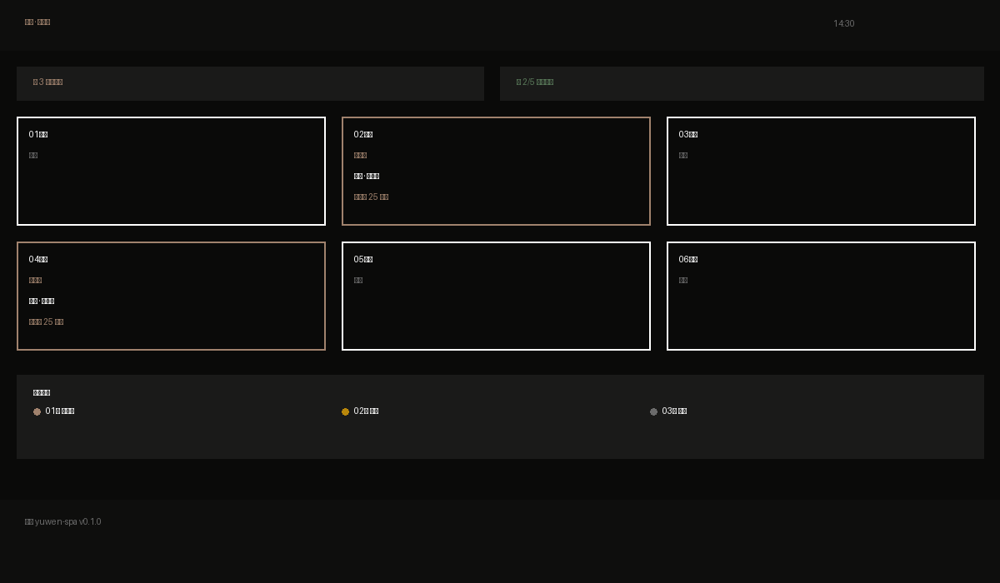
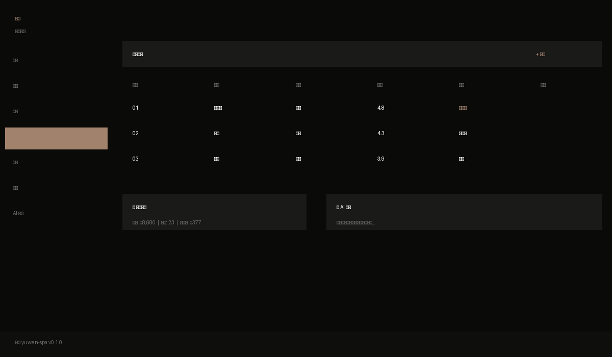

# 足韵 yuwen-spa

> **Yuwen Spa** — Offline Foot Bath SaaS for Local Deployment. One host, the whole shop.

<p align="center">
  
</p>

## Overview

**Yuwen Spa** is a local-first SaaS platform designed for offline foot bath / massage shops. A single always-on mini PC runs the backend and database, and every device in the store — cashier, owner tablet, technician phone, customer phone — just opens a browser. No cloud dependency, no internet required for core operations.

## What It Solves

Covers the full daily workflow of a physical foot bath store:

| Module | Features |
|--------|----------|
| **POS (收银台)** | Open service, assign technician, checkout, receipt printing |
| **Dashboard (排钟看板)** | Real-time room status across all screens |
| **Members (会员)** | Stored-value cards, punch cards, discount cards |
| **Technicians (技师)** | Attendance, commission tracking, daily performance |
| **Customer View (顾客端)** | QR code to check history, balance, add services |
| **Admin (老板看板)** | Daily revenue, monthly reports, cross-store aggregation |
| **AI Assistant (AI 助手)** | Intelligent technician scoring, business reports, scheduling suggestions |
|| **Notifications (通知)** | Enterprise WeChat / Feishu / DingTalk / Slack / Discord webhook |
|| **Reports (经营报表)** | Daily revenue, technician performance, CSV export, business summary |
|| **PWA (渐进式应用)** | Offline-capable, installable, service worker cache |

## Design Principles

1. **Local-first** — One host per store, works offline
2. **Zero client** — Browser is the only interface, no apps or mini-programs
3. **Touch-friendly** — POS works well on tablets and touch-screen displays
4. **Non-intrusive** — Minimal by default; advanced features via shortcut keys
5. **Chinese aesthetic** — Ink-wash, rice paper tones; distinct from Meituan/Youzan

## Architecture

```
        Host (mini PC, always-on)
        Node.js + Fastify + SQLite
        Listening on 0.0.0.0:8080
              │
              ├── Hermes Gateway (127.0.0.1:8642)
              │    └── AI Chat / Technician Scoring / Business Reports
              │
       LAN WiFi (same WiFi = accessible)
              │
   ┌──────────┼──────────┬───────────┐
   Cashier     Owner     Technician   Customer
   Tablet      iPad      Phone       Phone
   Browser     Safari    Browser     Scan QR
```

<p align="center">
  
  <br>
  <em>POS Dashboard — Real-time room status and active services</em>
</p>

## Tech Stack

**Backend**
- Node.js 20+
- [Fastify](https://fastify.io) (lightweight HTTP framework)
- `better-sqlite3` (synchronous SQLite, single-file DB)
- WebSocket (real-time room sync)
- `@fastify/compress` / `@fastify/formbody` (response compression, form parsing)

**Frontend**
- [Vite](https://vitejs.dev) + React 19 + TypeScript
- Tailwind CSS 3.4
- [TanStack Query](https://tanstack.com/query) (data fetching)
- Zustand (state management)
- [Framer Motion](https://www.framer.com/motion/) (animations)
- Lucide React (icons)

**Security**
- Content-Security-Policy headers
- X-Frame-Options / X-Content-Type-Options / X-XSS-Protection
- Request body size limiting (1MB) and timeout (30s)
- JWT authentication with scrypt password hashing
- Rate limiting on login endpoint

**Build**
- Vite code splitting (vendor, query, page-level chunks)
- esbuild minification with tree-shaking

## Quick Start

### Development Mode

```bash
# Backend (port 8080)
cd server && npm run dev

# Frontend (port 5173, auto-proxies to backend)
cd web && npm run dev
```

### Production Build

```bash
# Build frontend and copy to server/public
npm run build

# Start server (single process serves both API and static files)
cd server && node src/index.js
```

The app will be available at `http://localhost:8080` and all LAN IPs.

### Docker (Optional)

```bash
cd server && docker build -t yuwen-spa .
docker run -p 8080:8080 -v yuwen-data:/app/db yuwen-spa
```

## Project Structure

```
yuwen-spa/
├── server/                  # Backend + DB + static hosting
│   ├── src/
│   │   ├── index.js         # Entry point (Fastify + security + compression)
│   │   ├── lib/network.js   # Shared network utilities
│   │   ├── db/init.js       # SQLite schema, migrations, seed data
│   │   ├── auth/            # JWT, password hashing, rate limiting
│   │   ├── routes/          # REST API routes by business module
│   │   ├── ai/              # AI agent (technician scoring, reports)
│   │   ├── notify/          # Enterprise WeChat webhook notifications
│   │   ├── realtime/        # WebSocket event bus for room sync
│   │   └── backup/          # Database backup module
│   ├── db/                  # SQLite files + backups
│   └── public/              # Frontend build output
├── web/                     # Frontend source (Vite + React)
│   ├── src/
│   │   ├── App.tsx          # Router config with lazy loading
│   │   ├── main.tsx         # Entry with ErrorBoundary + QueryClient
│   │   ├── lib/             # API, auth, realtime hooks, notifications
│   │   ├── layouts/         # POS, Tech, Admin layouts
│   │   ├── pages/           # Login + POS/Tech/Admin/Guest pages
│   │   └── components/      # Shared components (ChangePassword, TechProfile)
│   ├── vite.config.ts       # Build config with code splitting
│   ├── tsconfig.json        # Strict TypeScript
│   └── tailwind.config.js   # Chinese-inspired color palette
├── tools/
│   └── copy-web.mjs         # Copy web/dist → server/public
├── installers/              # Platform launchers
│   ├── start.bat            # Windows
│   ├── start.command        # macOS
│   └── start.sh             # Linux
├── docs/
│   └── screenshots/         # App screenshots for README
└── README.md
```

## API Endpoints

| Method | Endpoint | Description | Auth |
|--------|----------|-------------|------|
| GET | `/api/health` | Health check | Public |
| GET | `/api/system` | System info (CPU, memory, LAN IPs) | Public |
| POST | `/api/auth/login` | Login with username/password | Public |
| GET | `/api/auth/me` | Get current user info | Required |
| PUT | `/api/auth/password` | Change password | Required |
| GET | `/api/tickets` | List tickets (with filters) | Required |
| POST | `/api/tickets` | Create ticket (open service) | Required |
| POST | `/api/tickets/:id/start` | Start service | Required |
| POST | `/api/tickets/:id/complete` | Complete service | Required |
| POST | `/api/tickets/:id/pay` | Checkout / pay | Required |
| POST | `/api/tickets/:id/cancel` | Cancel ticket | Required |
| GET | `/api/tickets/today` | Today's tickets (real-time board) | Required |
| GET | `/api/rooms` | List rooms | Required |
| GET | `/api/services` | List services | Required |
| GET | `/api/technicians` | List technicians | Required |
| GET | `/api/customers` | List customers | Required |
| GET | `/api/dashboard/live` | Real-time dashboard data | Required |
| GET | `/api/ai/config` | Get AI configuration | Required |
| POST | `/api/ai/chat` | AI chat (business assistant) | Required |
| WS | `/api/realtime` | WebSocket for real-time sync | Public |

## Deployment

1. **Install Hermes Agent** (one-time setup for AI features):
   ```bash
   bash installers/setup-hermes.sh
   ```
   - Installs Hermes Gateway on port 8642
   - Guides you through API Key configuration (DeepSeek recommended)

2. **Start the app**:
   ```bash
   # macOS
   open installers/start.command
   
   # Windows
   installers/start.bat
   
   # Linux
   bash installers/start.sh
   ```

3. **Access from any device** on the same LAN:
   ```
   http://<host-ip>:8080
   ```

> **AI Models**: Manage models via [Hermes Web UI](http://localhost:8642). Yuwen Spa only calls the API — it doesn't care which model is behind it.

## Screenshots

<p align="center">
  
  <br>
  <em>Admin Panel — Manage technicians, services, members, and settings</em>
</p>

## License

MIT

---

|> **中文说明**
>
> **足韵** 是一款专为线下足浴/足疗门店设计的本地部署 SaaS 系统。
>
> - **核心特点**：一台不断电的小型主机运行后端 + 数据库，店内所有设备（收银台、老板平板、技师手机、顾客手机）打开浏览器即可使用
> - **断网可用**：不依赖云服务，断网不影响开钟、结账、查账等核心业务
> - **零客户端**：无需安装 App 或小程序，浏览器即入口
> - **中国风设计**：宣纸、墨色调，区别于美团/有赞的互联网风格
> - **AI 赋能**：内置 AI 助手，可进行技师月度评分、生成经营日报、智能排钟建议
> - **多平台通知**：企业微信、飞书、钉钉、Slack、Discord 五种通知渠道
> - **经营报表**：日营收、技师绩效、CSV 导出、经营摘要一目了然
> - **PWA 支持**：可安装到手机主屏幕，离线可用
>
> 查看 [GitHub Release](https://github.com/yuluyangguang1/yuwen-spa/releases) 获取最新版本。

---

## 项目成长路线

| Phase | 目标 | 状态 |
|-------|------|------|
| **Phase 1** | 核心完善（开钟、结账、会员、技师、排钟、AI 助手） | ✅ 已完成 |
| **Phase 2** | 多店连锁管理、总部报表、跨店数据聚合 | 🔜 规划中 |
| **Phase 3** | 客户营销（预约、积分、优惠券、会员等级） | 🔜 规划中 |
| **Phase 4** | AI 深化（智能排钟、语音点单、经营预测、自动调价） | 🔜 规划中 |
| **Phase 5** | 生态扩展（PWA 完整支持、微信小程序、硬件对接、开放 API） | 🔜 规划中 |

## 同类项目研究

| 项目 | Stars | 技术栈 | 说明 |
|------|-------|--------|------|
| [FloCafe](https://github.com/FreeOpenSourcePOS/FloCafe) | 92★ | Electron + React + SQLite | 免费开源咖啡店 POS |
| [small-pos-open-source](https://github.com/longnick/small-pos-open-source) | 92★ | React + TypeScript + Vite + PWA | 离线优先零售 POS |
| [pos-pro](https://github.com/Hao0321/pos-pro) | 19★ | Electron + React | 传统中文离线零售 POS |
| [SalonPro ERP](https://github.com/Abhijayshah/salonpro-erp) | — | TypeScript | 美容院/SPA 一体化 SaaS |
| [puntovivo](https://github.com/johnny4young/puntovivo) | 3★ | Fastify + tRPC + SQLite | 拉美财税原生 POS |

> 足韵的差异化：**纯 Web 零客户端 + 中国风美学 + AI 深度集成**，区别于 Electron 桌面类方案。

---

<p align="center">
  <a href="https://github.com/yuluyangguang1/yuwen-spa">
    
  </a>
  <a href="https://github.com/yuluyangguang1/yuwen-spa/stargazers">
    
  </a>
  <a href="https://github.com/yuluyangguang1/yuwen-spa/blob/main/LICENSE">
    
  </a>
  <a href="https://nodejs.org">
    
  </a>
  <a href="https://fastify.io">
    
  </a>
  <a href="https://react.dev">
    
  </a>
  <a href="https://vitejs.dev">
    
  </a>
</p>
